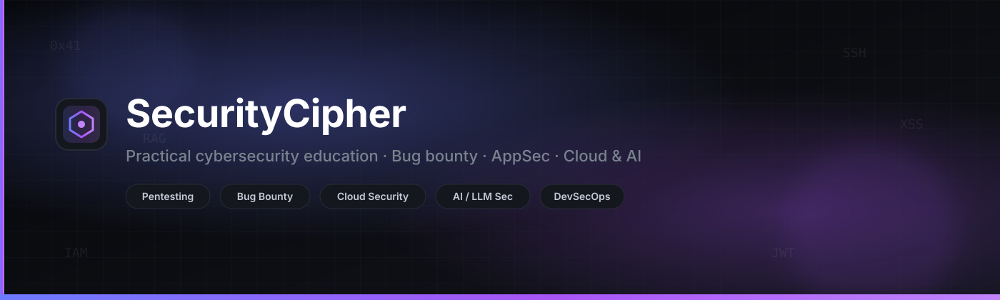

<!--
  SecurityCipher GitHub profile README
  Brand: https://securitycipher.com
-->

  

   

  

  

    <strong>Hi, I'm Piyush Kumawat</strong> · I break things on purpose, then teach others how to find and fix them. 
    Hands-on write-ups, interactive checklists, roadmaps, and tools at
    <a href="https://securitycipher.com"><strong>securitycipher.com</strong></a>
  

  

    
    
    
    
  

  

    
    
    
    
  

## About

I am a penetration tester and Staff Product Security Engineer focused on **web, API, mobile, cloud, and AI/LLM security**. Day to day that means real assessments, configuration reviews, and DevSecOps work - then turning the sharp edges into public guides so more people can test the same way.

I publish at [securitycipher.com](https://securitycipher.com): practical playbooks, interactive checklists, a penetration testing roadmap, curated security tools, CVE lookup, and bug bounty write-ups.

  
<b>What I work on</b>

   

  | Area | What that looks like |
  | :--- | :--- |
  | **Web & API** | AuthN/Z flaws, injection, business logic, GraphQL, IDOR/BOLA |
  | **Cloud** | AWS / Azure / GCP config reviews, IAM, network exposure |
  | **AI / LLM** | Prompt injection, RAG poisoning, agent & MCP security |
  | **Bug bounty** | Recon-to-report workflows, high-signal hunting notes |
  | **Teaching** | Roadmaps, checklists, quizzes, and field manuals |

## Start here

<table>
  <tr>
    <td width="50%" valign="top">

### Learn
- [Penetration Testing Roadmap](https://securitycipher.com/penetration-testing-roadmap/)
- [Start Here path](https://securitycipher.com/start-here/)
- [OWASP Top 10 Explorer](https://securitycipher.com/owasp-top-10-explorer/)
- [Bug Bounty Playbook](https://securitycipher.com/bug-bounty-playbook/)
- [Payload Field Manual](https://securitycipher.com/payload-cheatsheets/)

    </td>
    <td width="50%" valign="top">

### Practice & reference
- [Security Checklists hub](https://securitycipher.com/security-checklists/)
- [Writeup Checklists](https://securitycipher.com/writeup-checklists/)
- [Security Tools database](https://securitycipher.com/security-tools/)
- [CVE Lookup](https://securitycipher.com/cve-lookup/)
- [Cybersecurity Blog](https://securitycipher.com/blog/)

    </td>
  </tr>
</table>

## Featured open source

| Project | Stars | What it is |
| :--- | :---: | :--- |
| [**penetration-testing-roadmap**](https://github.com/securitycipher/penetration-testing-roadmap) |  | Complete roadmap to become a pentester |
| [**daily-bugbounty-writeups**](https://github.com/securitycipher/daily-bugbounty-writeups) |  | Curated bug bounty write-ups to study |
| [**awsome-websecurity-checklist**](https://github.com/securitycipher/awsome-websecurity-checklist) |  | Web application security testing checklist |
| [**Bug-Bounty-Resources**](https://github.com/securitycipher/Bug-Bounty-Resources) |  | Handpicked tools, guides, and tips |
| [**vulnerable-code-snippet**](https://github.com/securitycipher/vulnerable-code-snippet) |  | Vulnerable vs secure code examples |
| [**guide-for-burp-suite**](https://github.com/securitycipher/guide-for-burp-suite) |  | Beginner-friendly Burp Suite guide |

  

## Latest from the blog

<!-- BLOG-POST-LIST:START -->
- [The CVE Flood Is a Lie: How to Hunt When AI Dumps 36% More Bugs But Exploitation Only Grows 10%](https://securitycipher.com/2026/08/25/cve-flood-triage-playbook-2026/)
- [RAG Poisoning in 2026: A Practical Playbook for Hacking Answers Through Your Knowledge Base](https://securitycipher.com/2026/08/19/rag-poisoning-2026-practical-playbook/)
- [Secrets That Pay: Hunting Valid Credentials with TruffleHog for Bug Bounties](https://securitycipher.com/2026/08/13/secrets-that-pay-trufflehog-bug-bounty/)
- [Software Supply Chain Security in 2026: Packages, Pipelines, and Provenance](https://securitycipher.com/2026/08/10/software-supply-chain-security-2026/)
<!-- BLOG-POST-LIST:END -->

  

## Snapshot

  
  
  
  

  Live metrics via Shields.io (no flaky third-party stats widgets).

## Toolkit

  
  
  
  
  
  
  
  
  
  
  
  
  
  

## Connect

  
  
  
  
  
  

 

  

  

    
      Built with care for pentesters, bug bounty hunters, and security engineers. 
      <a href="https://securitycipher.com"><strong>securitycipher.com</strong></a>
      ·
      <a href="https://securitycipher.com/services/">Services</a>
      ·
      <a href="https://securitycipher.com/contact-us/">Contact</a>
    
  

  

